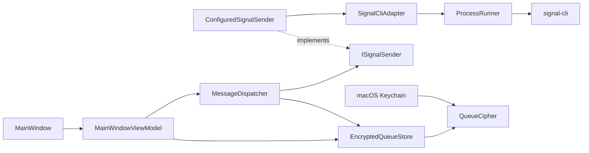

# SignalScheduler

A small macOS app for scheduling Signal messages and image attachments.

SignalScheduler does not modify Signal Desktop. It keeps scheduled messages in a local encrypted queue and sends them through a linked [`signal-cli`](https://github.com/AsamK/signal-cli) device.

Built with C#, .NET 8 and Avalonia.

## Features

- Schedule text messages and image attachments to phone numbers, full Signal usernames or username links.
- Use bundled `signal-cli` and Java; detect existing linked accounts automatically.
- Connect a new account through an in-app QR code.
- Attach images from disk or paste a screenshot directly from the macOS clipboard.
- Keep the message queue encrypted locally with AES-256-GCM.
- Store the encryption key separately in macOS Keychain.
- Recover conservatively after interrupted sends instead of retrying blindly.
- Build as a self-contained macOS app. Apple Silicon is manually tested; Intel is not yet validated.

## Architecture



`MainWindowViewModel` coordinates UI state and the scheduler tick. `MessageDispatcher` owns the delivery rules and depends only on `ISignalSender`, keeping Signal-specific process handling outside the scheduling logic.

Queue snapshots are encrypted before they reach disk. The encryption key is stored separately in macOS Keychain.

Before a send starts, the message is persisted as `Sending`. If the application is interrupted at that point, the message becomes `Unknown` on the next launch instead of being sent again automatically. This avoids turning an uncertain send into an accidental duplicate.

## Requirements

To run the packaged app: macOS and Signal on a primary phone for linking.
Homebrew, system Java and .NET are not required to run it.

To build from source: macOS, .NET 8 SDK, Python 3 and Internet access for the
first download of the pinned runtime dependencies. With Homebrew:

```bash
brew install --cask dotnet-sdk@8
```

## Build and run

```bash
git clone https://github.com/Alexandra-St/SignalScheduler.git
cd SignalScheduler

bash build-mac.sh
open "build/Signal Scheduler.app"
```

The build bundles pinned signal-cli and Temurin Java, verifies checksums, signs
locally and smoke-tests a relocated app against an isolated empty configuration.
It uses the private runtime; development runs outside the .app search PATH and
Homebrew locations. A custom executable can be selected in Settings.

Existing linked accounts are reused without relinking. For a new account, click
**Connect Signal**, then scan and approve on your phone through
**Signal → Settings → Linked Devices → Link New Device**.

To create a local DMG:

```bash
python3 packaging/distribute.py
```

The image is written under `build/distribution/`. Drag the app into Applications,
eject the DMG, then launch from Applications. To update, quit the app first and
choose **Replace**; keep your queue, Keychain key and Signal account data.
Local builds are ad hoc signed and not notarized. First-launch guidance is in the
[draft beta notes](docs/BETA_RELEASE.md). Developer ID/notarization are not
requirements for this beta.

Version and build number come from `Version.props` for .NET, Info.plist and DMG
naming. Increment the build number before each new test/distribution build and
increment the version for a released update. See [packaging](docs/PACKAGING.md).

The app must remain running and the Mac must stay awake until scheduled messages are sent.

## Tests

```bash
dotnet test Tests/SignalScheduler.Tests.csproj -c Release
python3 -m unittest discover -s packaging -p 'test_*.py'
```

The test suite covers queue compatibility and encryption, scheduling and send-state transitions, `signal-cli` integration boundaries, executable discovery and account selection. Tests use synthetic data and do not send real Signal messages. Headless UI
checks exercise bindings, Send at validation and QR cancellation/retry.
[Acceptance results](docs/BETA_ACCEPTANCE.md) separately record manual installation,
phone-approved QR linking and real delivery on the development Mac; clean-Mac
verification remains pending.

## Privacy and limitations

Scheduled messages, attachments and metadata stay on the local machine in an encrypted queue. SignalScheduler has no application backend or telemetry.

A few important caveats:

- Signal integration is provided through the unofficial `signal-cli` project. SignalScheduler is not affiliated with or endorsed by Signal.
- `Sent` means that `signal-cli` accepted the request; it does not mean the recipient received or read the message.
- There are no automatic retries after an uncertain send.
- The app cannot wake a sleeping Mac or send while it is closed.
- This version is macOS-only.

More details about the current security boundaries are available in [`SECURITY.md`](SECURITY.md).

## License

SignalScheduler is available under the [MIT License](LICENSE).

Bundled `signal-cli` is a separate GPL-3.0-or-later project; Java and its dependencies
retain their own licenses. See [third-party notices](THIRD_PARTY_NOTICES.md).

Before public binary distribution, finish the separate source/license review.
`python3 packaging/prepare_beta_sources.py` collects matching source archives,
Maven/Rust source assets and notices under ignored `build/beta-materials/`.
Its manifest remains REVIEW_REQUIRED until completeness has been reviewed;
upstream links alone do not close that requirement.
