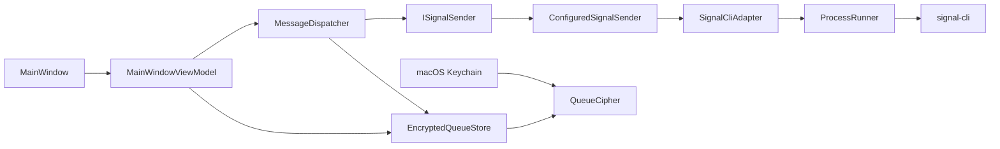

# SignalScheduler

A small macOS app for scheduling Signal messages and image attachments.

SignalScheduler does not modify Signal Desktop. It keeps scheduled messages in a local encrypted queue and sends them through a linked [`signal-cli`](https://github.com/AsamK/signal-cli) device.

Built with C#, .NET 8 and Avalonia.

## Features

- Schedule text messages and image attachments.
- Detect `signal-cli` and linked Signal accounts automatically.
- Attach images from disk or paste a screenshot directly from the macOS clipboard.
- Keep the message queue encrypted locally with AES-256-GCM.
- Store the encryption key separately in macOS Keychain.
- Recover conservatively after interrupted sends instead of retrying blindly.
- Build as a self-contained macOS app for Apple Silicon or Intel.

## Architecture



`MainWindowViewModel` coordinates UI state and the scheduler tick. `MessageDispatcher` owns the delivery rules and depends only on `ISignalSender`, keeping Signal-specific process handling outside the scheduling logic.

Queue snapshots are encrypted before they reach disk. The encryption key is stored separately in macOS Keychain.

Before a send starts, the message is persisted as `Sending`. If the application is interrupted at that point, the message becomes `Unknown` on the next launch instead of being sent again automatically. This avoids turning an uncertain send into an accidental duplicate.

## Requirements

- macOS
- .NET 8 SDK
- A current `signal-cli` installation
- Signal on a primary device for linking

Install the dependencies with Homebrew:

```bash
brew install --cask dotnet-sdk@8
brew install signal-cli
```

Link `signal-cli` to your Signal account:

```bash
signal-cli link -n "SignalScheduler"
```

Then scan the QR code from **Signal → Settings → Linked Devices → Link New Device**.

## Build and run

```bash
git clone https://github.com/Alexandra-St/SignalScheduler.git
cd SignalScheduler

bash build-mac.sh
open "build/Signal Scheduler.app"
```

SignalScheduler searches for `signal-cli` automatically and lists the accounts linked to it. A custom executable can also be selected in Settings.

The app must remain running and the Mac must stay awake until scheduled messages are sent.

## Tests

```bash
dotnet test Tests/SignalScheduler.Tests.csproj -c Release
```

The test suite covers queue compatibility and encryption, scheduling and send-state transitions, `signal-cli` integration boundaries, executable discovery and account selection. Tests use synthetic data and do not send real Signal messages.

## Privacy and limitations

Scheduled messages, attachments and metadata stay on the local machine in an encrypted queue. SignalScheduler has no application backend or telemetry.

A few important caveats:

- Signal integration is provided through the unofficial `signal-cli` project. SignalScheduler is not affiliated with or endorsed by Signal.
- `Sent` means that `signal-cli` accepted the request; it does not mean the recipient received or read the message.
- There are no automatic retries after an uncertain send.
- The app cannot wake a sleeping Mac or send while it is closed.
- This version is macOS-only.

More details about the current security boundaries are available in [`SECURITY.md`](SECURITY.md).

## License

SignalScheduler is available under the [MIT License](LICENSE).

`signal-cli` is a separate project and is licensed under GPL-3.0-or-later.
