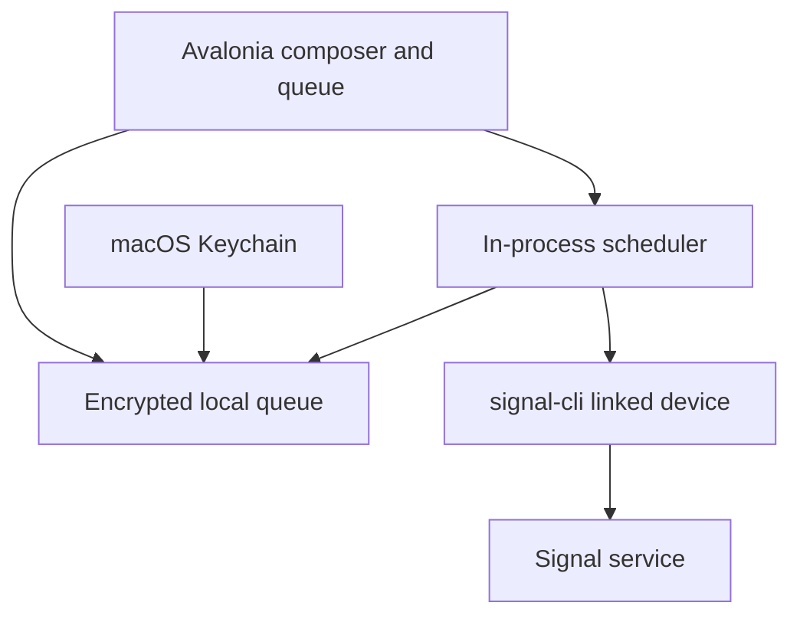

# SignalScheduler

A macOS companion for scheduling Signal messages and image attachments. Built with C# and Avalonia, it keeps the queue encrypted on the local machine and sends through a linked `signal-cli` device. Explicit message states and conservative recovery rules reduce the risk of duplicate or unexpectedly late sends.

## Problem

Scheduling a message should not require remembering to return to a conversation at the right time. SignalScheduler provides scheduled messaging for desktop Signal users through a separate composer and queue; it does not modify the official Signal Desktop interface.

## Screenshots & demo

- **Composer — placeholder:** recipient, message, image thumbnails and scheduled time.
- **Queue — placeholder:** pending, cancelled and completed messages.
- **Demo GIF — placeholder:** add a screenshot, schedule a message and observe its status change.

Public screenshots will use synthetic content and redact account and recipient identifiers.

## Features

- Schedule text and images to phone-number recipients.
- Detect the local linked account automatically; choose explicitly when several accounts exist.
- Select multiple photos or paste a screenshot from the macOS clipboard.
- Review image thumbnails and remove attachments before scheduling.
- Send images with or without a caption; up to 8 images and 20 MiB total per message.
- Cancel pending messages or copy an existing message into the composer.
- Persist message content, attachments and metadata in an AES-256-GCM encrypted queue.
- Store the encryption key in macOS Keychain.
- Recover interrupted sends as unknown rather than retrying automatically. Unknown or unsupported stored statuses also require manual review.
- Reject invalid or ambiguous daylight-saving times.
- Package a self-contained macOS application for Apple Silicon or Intel.

## Architecture



The UI handles composition and queue actions. `EncryptedQueueStore` encrypts snapshots, flushes writes before replacement and holds an exclusive instance lock. The ViewModel drives a five-second dispatcher timer; `MessageDispatcher` selects due messages and sends them serially through `ISignalSender`. `SignalCliAdapter` implements the external Signal integration.

## Tech stack

| Area | Technology |
| --- | --- |
| Language / runtime | C# / .NET 8 |
| Desktop UI | Avalonia 11.3, Fluent theme |
| Persistence | JSON snapshots encrypted with AES-256-GCM |
| Key storage | macOS Keychain via `/usr/bin/security` |
| Signal integration | Bundled JVM `signal-cli` with a private Temurin Java runtime; optional custom executable |
| Screenshot import | Native macOS clipboard via AppleScript |
| Packaging | Bash, `dotnet publish`, ad hoc code signing |

## How it works

1. Link `signal-cli` to an existing Signal account.
2. Compose a message, attach images if needed and select a future local time.
3. Save the message and its attachments to the encrypted queue.
4. When due, persist the `Sending` state before attempting the send.
5. Record acceptance by `signal-cli`, or flag an uncertain outcome for manual review.

Messages up to five minutes overdue are attempted when the app resumes. Older messages are marked missed and require manual rescheduling. A timeout, nonzero exit or interruption never triggers an automatic resend; check Signal before scheduling a copy.

`Sent` means `signal-cli` accepted the request, not that the recipient received or read it. Cancelled and completed messages remain in the encrypted queue until deleted.

## Getting started

### Requirements

- macOS; Apple Silicon or Intel.
- .NET 8 SDK to build the application.
- Python 3 and Internet access for the first local build.
- Signal on a primary mobile device for linking.

The `.app` includes pinned `signal-cli` and Java runtimes. Running it does not require Homebrew, system Java or .NET. Building from source still requires the SDK and Python; QR onboarding and a local DMG are included; official Developer ID signing and notarization require publisher credentials.

### Install build tools

With Homebrew:

```bash
brew install --cask dotnet-sdk@8

dotnet --list-sdks
```

### Build and launch

From the repository root:

```bash
bash build-mac.sh
open "build/Signal Scheduler.app"
```

The script detects the architecture, publishes self-contained .NET, downloads the
pinned upstream JVM `signal-cli` and matching Temurin JRE, checks SHA-256, includes
licenses and signs the bundle ad hoc for local use. Verified downloads are cached
under `build/dependency-cache/`. Versions and artifact hashes are tracked in
`packaging/dependencies.lock.json`; the build never selects a moving latest release.

The final smoke check relocates the app and exercises the private Java runtime and
account discovery with a minimal PATH and an isolated empty configuration. This
checks independence from Homebrew/system Java on the build Mac; testing on an actual
clean Mac and Intel hardware is still required before a public release.

To create a local installation image after building, run `python3 packaging/distribute.py`.
The image is placed in `build/distribution/`; drag the app to Applications.
Local images are not notarized public releases.
See [packaging verification](docs/PACKAGING.md) and [third-party notices](THIRD_PARTY_NOTICES.md).

### Link your account

Existing linked accounts are reused in their original signal-cli data directory.
No credentials or account data are copied into the `.app`. If you have already
linked an account, skip this step.

For a new account, click **Connect Signal** on the welcome screen. On your phone,
open **Signal → Settings → Linked Devices → Link New Device**, scan the code,
and approve the new device. The account is detected and selected automatically
when linking succeeds. You can also connect another device from **Settings → signal-cli**.

The code is generated locally and shown only while the connection is active.
Cancel or close the window to stop linking. An expired code can be replaced with
**Try again**. Use device linking, not registration of your existing number.
Do not share QR codes, linking URIs or account output in issues.
Do not run a separate `signal-cli` daemon against the same account while using this application.

### Schedule a message

1. The packaged app validates and uses its private `signal-cli` runtime. Development runs outside the `.app` search PATH, then standard Homebrew locations. For a custom installation, open **Settings → signal-cli**, choose an executable, or return to **Use automatic detection**. The path is read-only; the version is shown after validation.
2. The linked account is detected on startup. If several accounts exist, choose one; account discovery runs automatically after linking; **Refresh accounts** is available for recovery. The **From** dropdown is the only account selector; scheduling stays disabled until a detected account is selected. Enter the recipient's international phone number.
3. Add text or images. To capture a screenshot to the clipboard, press **Control + Shift + Command + 4**, then click **Paste screenshot**.
4. Enter the local date and time as `yyyy-MM-dd HH:mm` and click **Schedule message**.
5. Keep the application open and the Mac awake with network access.

Start with a message to your own number and verify it in **Note to Self**. See [manual verification](docs/VERIFICATION.md) for recovery and attachment checks.

### Update

Quit the application, replace the source files and rebuild. Moving the source folder or rebuilding does not require relinking Signal. Preserve the existing queue and Keychain entry.

Queue mutations go through `Add`, `Remove` and `ChangeStatus`, which persist automatically. `Items` is read-only; queue serialization and saving remain internal to the store.

## Project structure

| Path | Responsibility |
| --- | --- |
| `Program.cs`, `App.cs` | Entry point and Avalonia application initialization |
| `Models/` | Scheduled messages, image attachments and strongly typed `MessageStatus` values |
| `Services/MessageDispatcher.cs` | Due-message selection, serial sending and outcome transitions |
| `Persistence/EncryptedQueueStore.cs` | Queue snapshots, compatible status-string conversion, file replacement, instance locking and restart recovery |
| `Integrations/Signal/` | Signal sender boundary and `signal-cli` adapter |
| `Security/` | AES-GCM queue envelope and macOS Keychain access |
| `Infrastructure/` | Subprocess execution, macOS application paths and clipboard image import |
| `Views/*.axaml` | Compiled bindings, shared styles and data templates for the composer, message cards and Settings |
| `Views/*.axaml.cs` | Window lifecycle and native file pickers |
| `Presentation/` | Property notifications, UI commands and status labels |
| `ViewModels/` | Composer coordination, Signal configuration, message cards and attachment previews |
| `Tests/` | Queue compatibility, encryption, dispatcher, subprocess integration and headless UI regression tests |
| `SignalScheduler.csproj` | Application runtime and Avalonia dependencies |
| `build-mac.sh`, `packaging/` | Pinned dependency packaging, checksum/archive validation, bundle signing and relocation smoke checks |
| `.gitignore`, `.editorconfig` | Runtime-data exclusions and shared source formatting settings |
| `docs/VERIFICATION.md` | Automated verification scope and manual macOS acceptance checks |
| `SECURITY.md`, `LICENSE` | Security boundaries and MIT license |

### Run regression tests

```bash
dotnet test Tests/SignalScheduler.Tests.csproj -c Release
```

Tests use synthetic data and a fake Signal sender or local subprocess. Headless Avalonia tests exercise XAML bindings, card actions, attachment removal and read-only Settings without opening a real queue or starting the scheduler. They do not link an account or send real messages. Filesystem and subprocess checks are intended for macOS and Linux; they do not exercise Keychain, native clipboard permissions or live Signal delivery.

## Security & privacy

Scheduled messages, attachment bytes and metadata are stored locally in an encrypted file under `~/Library/Application Support/SignalScheduler/`. A randomly generated 256-bit key is kept in macOS Keychain. File and directory permissions restrict queue access to the current user. There is no application backend or telemetry; sending still connects to the Signal service through `signal-cli`.

**Credentials, Signal account data, linking QR codes, device identifiers, local databases, logs and real conversations must never enter this repository.** The application does not include an account configuration or credentials. `signal-cli` manages its own account keys and storage outside the project.

Message text is passed on standard input, not shell command arguments. Image files are temporarily materialized in a private local directory for clipboard import or sending, then deleted; leftovers are cleaned on the next successful queue open. Deletion is not secure erasure, and image metadata is not stripped.

Encryption protects the queue at rest, not against code running as the unlocked macOS user. Account and recipient identifiers appear in subprocess arguments. Initial Keychain setup briefly passes the generated encryption key as an argument to `security`. See [SECURITY.md](SECURITY.md) for the current security boundaries.

## Roadmap

- Full-size attachment viewer.
- Date/time picker and quick scheduling presets.
- Contact selection and group recipients.
- Direct editing and rescheduling of pending messages.
- Extend automated coverage to composer validation and UI lifecycle behavior.
- Background execution, login startup and clearer sleep/offline handling.
- Explore scheduling inside a separately maintained Signal Desktop build.

## Limitations

- Uses **unofficial Signal integration** through `signal-cli`; not affiliated with or endorsed by Signal.
- macOS only in this version; Keychain and clipboard handling are platform-specific.
- Scheduling happens in this companion app, not inside the official Signal client.
- The app must remain running; it does not wake a sleeping Mac or send after being closed.
- Timing is approximate; the scheduler checks every five seconds and depends on connectivity.
- No automatic retries or exactly-once delivery guarantee.
- Recipients are phone numbers; no contact picker, groups, video or voice-message workflow.
- Thumbnails cannot yet be opened full-size; HEIC/HEIF previews depend on decoder support.
- The complete encrypted queue is rewritten on every change; retention is manual, and large histories consume memory and disk space.
- No independent security audit or notarized release yet. Automated tests cover queue and dispatch behavior; native macOS workflows require manual verification.
- `signal-cli` must stay compatible with Signal service changes.

## License

[MIT](LICENSE). External dependencies retain their own licenses; Bundled `signal-cli` is licensed under GPL-3.0-or-later; Temurin has its own included licenses. See [third-party notices](THIRD_PARTY_NOTICES.md).

Executable preferences are stored locally outside the repository. Automatic mode searches again on startup and before delivery; queued messages use the current validated executable rather than their historical saved path. Version validation checks identity output, not cryptographic authenticity.

## Beta preparation

The next beta's [draft release notes](docs/BETA_RELEASE.md) include installation and
first-launch instructions. [Acceptance results](docs/BETA_ACCEPTANCE.md) distinguish
automated checks from pending phone/clean-Mac verification. Source materials are
collected separately with `python3 packaging/prepare_beta_sources.py`; their manifest
requires review before public binary distribution.
